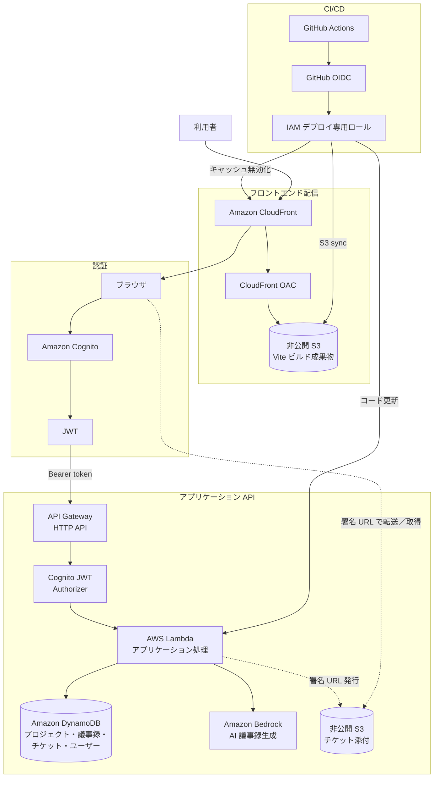

# AIプロジェクト管理

プロジェクト・議事録・チケットを一元管理する、承認フロー付きの業務管理アプリです。会議原文を保存して Amazon Bedrock で AI 議事録（要約・決定事項・TODO）を生成し、抽出した TODO をチケット化して担当者・期限・進捗を管理できます。フロントエンドからバックエンドまで AWS のサーバーレス構成で公開しています。

[](https://github.com/toru1064/ai_minutes/actions/workflows/ci.yml)
[](https://github.com/toru1064/ai_minutes/actions/workflows/deploy-frontend.yml)
[](https://github.com/toru1064/ai_minutes/actions/workflows/deploy-lambda.yml)

## 公開デモ

| 項目 | 内容 |
| --- | --- |
| 公開 URL | **https://d6poxps1sqgd0.cloudfront.net/** |
| メールアドレス | `ai.minutes.demo@gmail.com` |
| パスワード | `DemoUser1!` |

> **利用前にご確認ください**
>
> - 認証情報は共有の Cognito デモアカウント専用です。他のサービスへ転用しないでください。
> - 既存のサンプルデータは閲覧専用です。デモユーザーが作成したデータは編集でき、作成から24時間後に DynamoDB TTL で自動削除の対象になります（削除時刻には遅延が生じる場合があります）。プロジェクト・議事録・チケットを利用者が任意に削除する機能は、現在の画面／API にはありません。
> - AI 生成は1日3回、通常の作成・編集操作は1日30回までです。回数上限と作成データは、同じ Cognito ユーザーを利用する全員で共有されます。
> - 添付ファイルはダウンロードのみ利用でき、追加・削除およびプロフィール編集はできません。
> - 他の利用者も同じ共有アカウントで作成されたデータを操作できる可能性があります。機密情報・個人情報は入力しないでください。

<!-- スクリーンショット追加候補: ダッシュボード / 議事録詳細とAI生成結果 / プロジェクト一覧 / チケット一覧 / スマートフォン表示 -->

## 主な機能

- **認証とホーム画面** — Amazon Cognito Hosted UI によるログイン／ログアウト後、ダッシュボードで自分の未着手・進行中・期限超過・期限間近のチケットを確認できます。
- **プロジェクト管理** — プロジェクト名、責任者、期間、状態、概要を登録・編集し、関連する議事録をプロジェクト詳細からたどれます。
- **議事録管理と AI 生成** — プロジェクト、会議情報、担当者、承認者、会議原文を保存し、その原文から Amazon Bedrock で要約・決定事項・TODO を生成します。再生成した結果も DynamoDB に保存され、後から再表示できます。
- **TODO のチケット化** — AI が抽出した TODO を選び、内容・担当者・期限・優先度を確認または修正して、一件ずつ／まとめてチケットに登録できます。登録済み候補の重複操作も画面上で判別します。
- **チケット管理** — プロジェクトおよび元議事録と関連付け、担当者、期限、優先度、状態（未着手・進行中・完了）、処理結果を管理できます。「自分のチケット」では Cognito のユーザー ID によって担当分だけを表示します。
- **承認フロー** — 議事録を下書きから承認依頼し、承認または理由付きで差し戻せます。差し戻し後の再申請（再承認フロー）にも対応し、承認時点の関連チケット進捗を記録します。
- **検索・絞り込み** — 議事録、プロジェクト、チケットのフリーワード検索に加え、画面ごとの動的フィルター、並べ替え、チケットの完了表示切り替えを利用できます。
- **プロフィールと担当者選択** — 自分の表示名を登録・編集し、プロジェクト責任者、議事録担当者・承認者、チケット担当者の選択に利用できます（DemoUser は編集不可）。
- **変更履歴** — プロジェクト・議事録・チケットの作成／更新、AI 生成・再生成、承認操作、添付操作を時系列で確認できます。会議原文や AI 出力そのものは履歴へ複製しません。
- **S3 添付ファイル** — 通常ユーザーはチケット詳細からファイルを追加・ダウンロード・削除できます。ファイル本体は非公開 S3 に直接送信し、ダウンロードにも期限付き署名 URL を使います。
- **レスポンシブ UI** — PC では情報量の多い表、幅 768 px 以下ではカード形式を使い分け、検索・動的フィルターもスマートフォン向けに再配置します。
- **制限付きデモ** — `DemoUser` グループではサンプルデータを保護し、作成者所有データだけを変更可能にします。日次回数制限と24時間 TTL により公開デモの利用範囲を制御します。

## 代表的な利用の流れ

1. プロジェクトを登録する。
2. プロジェクトに議事録を登録し、会議原文を保存する。
3. 議事録詳細から Bedrock による AI 議事録を生成する。
4. 抽出された TODO を確認・編集し、チケットとして登録する。
5. チケットの担当者・期限・優先度・状態・処理結果を更新する。
6. 議事録を承認依頼し、承認または差し戻す。差し戻し後は修正して再申請する。

## AWS 構成



### AWS サービスごとの役割

| サービス | 役割 |
| --- | --- |
| Amazon CloudFront | HTTPS でフロントエンドを配信し、更新時は GitHub Actions からキャッシュを無効化します。 |
| Amazon S3（フロントエンド） | Vite の静的ビルド成果物を保存する非公開オリジンです。 |
| CloudFront OAC | CloudFront からフロントエンド用 S3 への署名付きアクセスだけを許可します。 |
| Amazon Cognito | Hosted UI と Authorization Code Flow で利用者を認証し、JWT を発行します。 |
| Amazon API Gateway HTTP API | API の入口です。全アプリルートに Cognito JWT Authorizer を設定し、検証済み claims を Lambda へ渡します。 |
| AWS Lambda | ルーティング、入力検証、認可、業務処理を行い、各データサービス・Bedrock・S3 を呼び出します。 |
| Amazon DynamoDB | プロジェクト、議事録、チケット、プロフィール、デモ利用回数を保存します。 |
| Amazon Bedrock | 保存済み会議原文を要約し、決定事項と TODO を構造化して生成します。 |
| Amazon S3（添付ファイル） | チケット添付の本体を非公開で保存します。ブラウザとの転送には Lambda が発行する署名 URL を使います。 |
| AWS IAM | Lambda 実行権限と CI/CD のデプロイ権限を役割別に分離します。 |
| GitHub Actions | PR の品質確認と、`main` 更新後の対象別デプロイを自動化します。 |
| GitHub OIDC | 長期アクセスキーを保存せず、Actions が IAM ロールの一時認証情報を取得するために使います。 |
| Amazon CloudWatch Logs | Lambda の想定外例外を記録します。リクエスト本文や claims を意図的にログ出力しない実装です。 |
| AWS WAF | CloudFront に Web ACL を関連付ける場合の追加保護です。API Gateway 全体を直接保護するものではありません。なお、Web ACL の導入状態はリポジトリ内のコード／文書からは確認できません。 |

## 技術スタック

| 役割 | 採用技術 |
| --- | --- |
| フロントエンド | HTML / CSS / JavaScript（ES Modules）、`oidc-client-ts` 3.5 系 |
| 開発・ビルド | Node.js 22（CI）、Vite 8.2 系、npm |
| バックエンド | Python 3.14（Lambda と CI）、boto3 1.43.77 |
| 認証 | Amazon Cognito Hosted UI、OIDC Authorization Code Flow |
| API | Amazon API Gateway HTTP API、Cognito JWT Authorizer |
| データベース | Amazon DynamoDB（`ai-minutes` / `ai-tasks` / `ai-users`） |
| 生成 AI | Amazon Bedrock Converse API、Amazon Nova Micro（`apac.amazon.nova-micro-v1:0`） |
| ストレージ / CDN | 非公開 Amazon S3、Amazon CloudFront、CloudFront OAC |
| セキュリティ | AWS IAM、JWT claims に基づく Lambda 認可、署名 URL、デモ利用制限 |
| CI/CD | GitHub Actions、GitHub OIDC、AWS CLI |
| テスト | Node.js test runner、Python `unittest`、Vite production build、構文検査 |

## セキュリティ設計

- **認証と認可を分離** — Cognito が認証し、API Gateway JWT Authorizer がトークンを検証します。そのうえで Lambda が JWT claims の `sub` と `cognito:groups` を使い、DemoUser 判定・所有権・操作可否を認可します。画面上の非表示制御だけには依存しません。
- **信頼境界をバックエンドに設定** — DemoUser が作る項目のデモ属性、所有者、失効時刻はクライアント値を除去して Lambda 側で付与します。担当者等の ID も `ai-users` と照合し、表示名のスナップショットをサーバー側の値で置き換えます。
- **デモデータの所有権** — 通常データは DemoUser から変更できません。デモデータは、項目に記録された所有者と認証済み `sub` が一致する場合のみ変更できます（共有アカウントのため利用者単位ではなくアカウント単位です）。
- **非公開 S3** — 添付用 S3 は公開せず、許可された形式・サイズ・個数を検証して短時間有効な署名 URL を発行します。フロントエンド用 S3 も公開せず、CloudFront OAC を経由する読み取りだけに限定します。
- **秘密情報を長期保存しない CI/CD** — GitHub Actions はアクセスキーではなく OIDC の一時認証情報を使います。デプロイ専用 IAM ロールは対象バケットへの同期、対象 CloudFront の invalidation、対象 Lambda のコード更新に絞り、Lambda 実行ロールと分離します。シークレットや AWS アカウント ID は Git に保存しません。
- **PR と本番権限の分離** — PR 用 CI には AWS 認証権限がありません。デプロイ job は `production` Environment を使い、Environment と OIDC trust policy を `main` に限定する設定を前提にします。Actions はタグではなくフルコミット SHA で固定されています。
- **原子的な利用回数制限** — DemoUser の AI 生成（1日3回）と通常書き込み（1日30回）は、DynamoDB の条件付き原子更新で同時リクエスト時も上限を判定します。デモ項目には24時間後の `expires_at` を付け、DynamoDB TTL の非同期削除対象にします。
- **例外情報の秘匿** — 想定外例外は CloudWatch Logs へ記録しつつ、イベント、本文、claims、識別子、例外詳細をクライアント応答に含めず、汎用メッセージを返します。

## 制限付きデモユーザーの設計

| 操作 | 通常ユーザー | DemoUser |
| --- | --- | --- |
| データ閲覧 | 可 | 可 |
| 既存の通常データ編集 | 可 | 不可 |
| データ作成 | 可 | 可（デモ属性・24時間 TTL を自動付与） |
| 作成したデモデータ編集 | 通常どおり可 | 所有者が一致する場合のみ可 |
| AI 議事録生成・再生成 | 可 | 1日3回 |
| 通常の作成・編集操作 | 可 | 1日30回 |
| 添付ダウンロード | 可 | 可 |
| 添付追加・削除 | 可（形式・サイズ・個数制限あり） | 不可 |
| プロフィール更新 | 可 | 不可（初回参照時に初期プロフィールを自動作成） |

共有デモアカウントでは複数の利用者が同一の Cognito `sub` を使います。このため、デモデータの所有権判定、日次回数カウンター、作成したデータは利用者間で共有されます。

## CI/CD

### Pull Request

`main` 向け PR では `.github/workflows/ci.yml` が次を実行します。AWS 用の ID token 権限や認証ステップはなく、AWS リソースは変更しません。

1. Node.js 22 で `npm ci`
2. 全 JavaScript と `vite.config.js` の構文確認
3. `npm test`
4. `npm run build`
5. Python 3.14 用依存関係の準備と導入
6. Python 構文確認
7. `python -m unittest discover -v`

### `main` へのマージと手動実行

- **フロントエンド変更時** — テスト、Vite ビルド、`dist/` の S3 同期、CloudFront 全パス invalidation を行います。
- **Lambda 変更時** — Python の構文確認とテスト、依存関係を含む ZIP の作成、既存 Lambda のコード更新、更新完了後の `Successful` / `Active` 確認を行います。
- `paths` 条件により変更された側だけをデプロイし、README だけの変更ではどちらの自動デプロイも起動しません。
- 両 workflow は `workflow_dispatch` による手動実行も可能です。Actions 障害時の手動デプロイ手順も [AWS_SETUP.md](AWS_SETUP.md#actions-を使わない手動デプロイ障害時) に残しています。
- OIDC で一時認証情報を取得し、`production` Environment と IAM trust policy で `main` に制限します。同種の本番デプロイは `concurrency` で直列化し、Actions はフルコミット SHA に固定しています。

> Repository の Environment 保護ルールや AWS 側の trust policy は Git 管理外です。初回構築時には [AWS_SETUP.md](AWS_SETUP.md#github-oidc-provider-と信頼ポリシー) に沿って実環境でも確認してください。

## データ構成

| DynamoDB テーブル | パーティションキー | 保存する主な情報 |
| --- | --- | --- |
| `ai-minutes` | `minutes_id` | `entity_type` でプロジェクトと議事録を同居させます。プロジェクト項目は `PROJECT#` 接頭辞付きキーを使い、議事録が `project_id` / `project_name` を保持します。 |
| `ai-tasks` | `task_id` | チケット、元議事録・プロジェクトとの関連、担当者、期限、優先度、状態、処理結果、添付メタデータを保存します。 |
| `ai-users` | `user_id` | ユーザープロフィールと DemoUser の日次 AI／書き込み回数カウンターを保存します。 |

デモ用のプロジェクト・議事録・チケットには `expires_at` を設定し、各データテーブルの DynamoDB TTL で削除します。テーブル作成時の設定を含む詳細は [AWS_SETUP.md](AWS_SETUP.md) を参照してください。

## 設計・実装上の工夫

- Lambda の入口では HTTP ルートと共通エラー処理を担当し、DynamoDB、プロジェクト、チケット、ユーザー、添付、Bedrock の処理をサービスモジュールへ分割しています。
- プロジェクト、議事録、チケットは ID で関連付け、一覧表示用の名前も保存します。名称変更時には関連項目を同期し、画面間を移動しやすくしています。
- AI 出力は一時表示で終わらせず議事録へ保存し、再表示・再生成と TODO のチケット化に利用します。生成／再生成の操作履歴は残しつつ、原文や生成本文を履歴へ重複保存しません。
- DemoUser の所有権、条件付き原子カウンター、TTL、添付操作禁止を Lambda で強制し、公開デモの改変・濫用・費用リスクを抑えています。
- 添付は Lambda にバイナリ本体を通さず、署名付き POST で S3 へ直接アップロードします。完了 API でオブジェクトを確認してからメタデータをチケットへ記録します。
- 動的フィルターの生成・比較処理を共通モジュール化し、議事録・プロジェクト・チケットの異なる項目と PC／モバイル表示で再利用しています。
- 768 px を境に表とカードを切り替え、PC の情報密度とスマートフォンの操作性を両立させています。
- 配信用 S3 を直接公開せず OAC を利用し、デプロイは GitHub OIDC と対象リソースに限定した IAM ロールで行います。PR の品質確認と本番デプロイも別 workflow に分けています。

## コスト対策

- Lambda、API Gateway、DynamoDB、S3、CloudFront、Bedrock を組み合わせたサーバーレス構成とし、常時稼働サーバーを置いていません。
- DemoUser は AI 生成を1日3回、通常書き込みを1日30回に制限し、デモデータを TTL で24時間後の削除対象にします。
- 添付アップロードは対応形式、1ファイル 5 MiB、1チケット10件までに制限し、DemoUser には許可しません。
- AI 処理には Amazon Nova Micro を使用し、最大出力トークン数も設定しています。
- 静的ファイルは CloudFront から配信し、ハッシュ付き asset のキャッシュを利用します。

DynamoDB はセットアップ文書でオンデマンドキャパシティを案内していますが、実環境の課金モードはリポジトリだけでは確認できません。各サービスは無料枠内を保証するものではなく、AWS の実利用量・リージョン・料金体系に応じて費用が発生します。

## ローカル実行

### 前提

- Git、Node.js 22、npm、Python 3.14 を利用できること
- 既存 AWS 環境（Cognito、API Gateway、Lambda、DynamoDB など）が構築済みであること
- Cognito App Client の callback URL / sign-out URL と API Gateway CORS に `http://localhost:5500/` を登録済みであること
- フロントエンド内の Cognito / API 接続設定が対象環境と一致していること

AWS アクセスキーをフロントエンドやリポジトリへ記載する必要はありません。AWS 側の構築・権限・CORS の詳細は [AWS_SETUP.md](AWS_SETUP.md) を参照してください。

### Windows PowerShell

```powershell
git clone https://github.com/toru1064/ai_minutes.git
Set-Location ai_minutes

py -3.14 -m venv .venv
.\.venv\Scripts\Activate.ps1

# requirements.txt（UTF-16 LE BOM）を一時的な UTF-8 ファイルへ変換
python scripts/prepare_requirements.py requirements.txt "$env:TEMP\ai-minutes-requirements.txt"
python -m pip install -r "$env:TEMP\ai-minutes-requirements.txt"

npm ci
npm run dev
```

ブラウザで <http://localhost:5500/> を開きます。PowerShell の実行ポリシーで仮想環境を有効化できない場合は、ポリシーを無理に変更せず `.venv\Scripts\python.exe` を各 Python コマンドに指定してください。

`requirements.txt` は現在 UTF-16 LE BOM 形式です。GitHub Actions でも `scripts/prepare_requirements.py` により一時的な UTF-8 ファイルへ安全に変換してから `pip` に渡し、元ファイルは変更しません。

## テスト

| 対象 | 主な検証内容 |
| --- | --- |
| Lambda / DynamoDB | API 認証、ルーティング先の処理、議事録の作成・更新履歴、担当ユーザー検証、DynamoDB 更新データ |
| DemoUser | group 判定、サーバー付与属性、所有権、レスポンスからの所有者非公開化、条件付き原子回数制限、初期プロフィール作成、通常データの保護 |
| 添付 | 認証必須、形式・サイズ・件数、ファイル名の無害化、S3 キー照合、署名 URL、完了・ダウンロード・削除履歴 |
| フロントエンド | Cognito リダイレクト URL、デモ表示、ユーザー情報の安全な表示、プロフィール保存、ナビゲーション、自分のチケット、期限・完了表示、添付フォーム |
| 検索 / レイアウト | 動的フィルター、一覧の絞り込み・並べ替えに関するユーティリティ、モバイルカードと 768 px 以下のレイアウト |
| ビルド / 依存関係 | Vite production build、JavaScript / Python 構文、UTF-8・UTF-16 requirements 変換 |

```powershell
npm test
npm run build
python -m unittest discover -v
```

CI と同じ構文確認を個別に行う場合は、Windows では対象の `.js` ファイルごとに `node --check` を、Python では次を実行します。

```powershell
python -m compileall -q -f -x '(^|/)(node_modules|dist|venv|\.venv)/' .
```

## ディレクトリ構成

```text
ai_minutes/
├─ frontend/                    # HTML/CSS/JavaScript と Node.js テスト
│  ├─ auth.js                   # Cognito/OIDC 認証とデモ表示
│  ├─ dynamic-filters.js        # 一覧共通の動的フィルター
│  └─ *.html / *.js / *.test.js
├─ lambda_function.py           # API ルーティング、認可、入力検証
├─ dynamodb_service.py          # 議事録の永続化
├─ project_service.py           # プロジェクト処理
├─ task_service.py              # チケット処理
├─ user_service.py              # プロフィール処理
├─ attachment_service.py        # 添付 S3 と署名 URL
├─ bedrock_service.py           # AI 議事録生成
├─ demo_access.py               # DemoUser 所有権・TTL・回数制限
├─ test_*.py                    # Python ユニットテスト
├─ scripts/
│  └─ prepare_requirements.py   # requirements の一時 UTF-8 変換
├─ .github/workflows/           # PR CI、frontend / Lambda deploy
├─ vite.config.js               # 複数ページの Vite build 設定
└─ AWS_SETUP.md                 # AWS 構築・運用の詳細手順
```

## 今後の改善案

- 独自ドメインと証明書の設定
- IaC（AWS CDK / Terraform など）による AWS 構成の再現性向上
- CloudWatch メトリクスに基づくアラームと通知
- API Gateway 側のレート制御など追加保護
- ブラウザを用いた E2E テスト
- デモ環境の利用状況・コストの可視化
- キーボード操作やコントラストを含む UI アクセシビリティの継続改善
